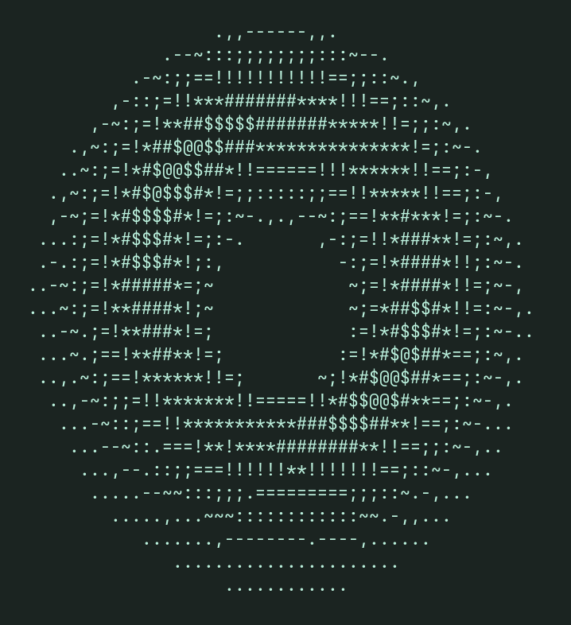
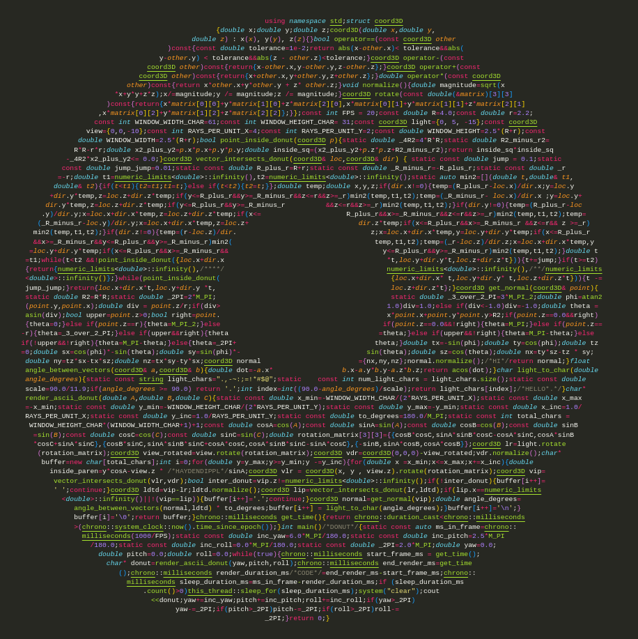

# Donut

THis is my original take on the spinning donut code. I used minimal outside resources in my implementation, creating my own original code.



## Installation

Clone the git repository...

```
git clone https://github.com/HaydenDippL/Donut.git
```

and run...

```
make
```

## Implementation



This code has two primary functions: `render_ascii_donut()`, `vector_intersects_donut()`, and `get_normal()`.

### `render_ascii_donut(yaw, pitch, roll)`

This function creates the string of the donut at any given yaw ($\alpha$), pitch ($\beta$), and roll ($\gamma$). The unique thing about this function is that it doesn't actually rotate the donut, but the light source and view point. We rotate through te following [rotation matrices](https://en.wikipedia.org/wiki/Rotation_matrix)

$$
\left[\begin{matrix}
cos(\alpha) & -sin(\alpha) & 0\\
sin(\alpha) & cos(\alpha) & 0\\
0 & 0 & 1
\end{matrix}\right]
\left[\begin{matrix}
cos(\beta) & 0 & sin(\beta)\\
0 & 1 & 0\\
-sin(\beta) & 0 & cos(\beta)
\end{matrix}\right]
\left[\begin{matrix}
1 & 0 & 0\\
0 & cos(\gamma) & -sin(\gamma)\\
0 & sin(\gamma) & cos(\gamma)
\end{matrix}\right]
$$

... which equate to

$$
\left[\begin{matrix}
cos(\alpha)cos(\beta) & cos(\alpha)cos(\beta)sin(\gamma)-sin(\alpha)cos(\gamma) & cos(\alpha)sin(\beta)cos(\gamma)+sin(\alpha)sin(\gamma)\\
sin(\alpha)cos(\beta) & sin(\alpha)cos(\beta)sin(\gamma)+cos(\alpha)cos(\gamma) & sin(\alpha)sin(\beta)cos(\gamma)+cos(\alpha)sin(\gamma)\\
-sin(\beta) & cos(\beta)sin(\gamma) & cos(\beta)cos(\gamma)
\end{matrix}\right]
$$

We use this rotation matrix to caclulate our view rays in the view array. First we must get the direction that the view rays will point. We calculate this by rotating view and finding the difference of the origin and view (normalize, too). This is the view_direction.

Each ray in the view array corresponds to a character on the screen. To rotate the view array it is actually easiest just to start with a flat view array at `view` and alter the $x$ and $y$ values, before we then rotate.

```
view_rotated = view.rotate(rotation_matrix)
view_direction_rotated = ({0, 0, 0} - view_rotated).normalize()
for (double y = y_max; y >= y_min; y -= y_inc)
    for (double x = x_min; x <= x_max; x += x_inc)
        view_loc_rotated = {x, y, z}.rotate(rotation_matrix)
```

The next step, once we have the view ray array, is to see if the light hits the donut. We accomplish this with the `vector_intersects_donut()` function.

Once we get the location of the first intersection of the view ray and the donut, we then must check to see how much light hits that point on the donut. We must accomplish this with two checks. First, does light reach the particualr point on the donut: is it shadowed and blocked off by another part of the donut? And if light does reach our point, what should be the brightness of that point?

To see if our point is shadowed we call `vector_intersects_donut()`. If our point equals the point returned, there is no shadow. So then we must get the normal vector on that point of the donut. We do this with `get_normal()`. Once we have the normal vector, we calculate the angle between the normal and the light direction...

$$
cos(\theta) = \frac{a \cdot b}{|a|*|b|}
$$

...and use this to angle to map to a ascii character `light_chars = ".,-~:;=!*#$@"`. Finally we store this character in the buffer.

### `vector_intersects_donut(loc, dir)`

This function calculates the point of intersection on the donut via ray tracing (I tried many different mathematically solutions, but could not find any closed form solutions and did not want to use approximation). By ray tracing I mean that the function slowly increments a particle from the vector start along the vector path until it reaches out of bounds or intersects the donut. 

```
t = t1
while (t < t2 && !point_inside_donut({loc.x + dir.x * t, loc.y + dir.y * t, loc.z + dir.z * t})) {
        t += jump;
}
```

We can tell if the vector intersects the donut via 

$$
(x^2+y^2+z^2+R^2+r^2)^2-4R^2(x^2+y^2)\le0
$$

If the algorithm finds an intersection, it slowly backtracks the particle for a better approximation of the point.

```
while (point_inside_donut({loc.x + dir.x * t, loc.y + dir.y * t, loc.z + dir.z * t})) {
        t -= jump_jump;
}
```

The algoritm has to account for the case that it nevers hits the donut. To accomplish this a box is virtually contructed around the donut and we find the parameterized points of intersection in the box ($t1$ and $t2$). We use these variables as a range we can try our parameterized variable $t$ over.

### `get_normal(point)`

This function uses a cartesian point $(x,y,z)$ to estimate the parameterized variables $\theta$ and $\phi$.

$$
\theta = atan2(y, x)\\
\phi = asin2(z / r)
$$

Once we get these variables we can follow the equations provided by [UC-Davis's Normal of a Torus](https://web.cs.ucdavis.edu/~amenta/s12/findnorm.pdf) article for two tangent vectors at the surface of the torus.

$$
t=(-sin(\phi), cos(\phi), 0)\\
s=(cos(\phi) * -sin(\theta), sin(\phi) * -sin(\theta), cos(\theta))
$$

Then we can take the [cross product](https://en.wikipedia.org/wiki/Cross_product) of these two equations to get the normal vector direction.

$$
n=(\\
t.y * s.z - t.z * s.y,\\
t.z * s.x - t.x * s.z,\\
t.x * s.y - t.y * s.x\\)
$$